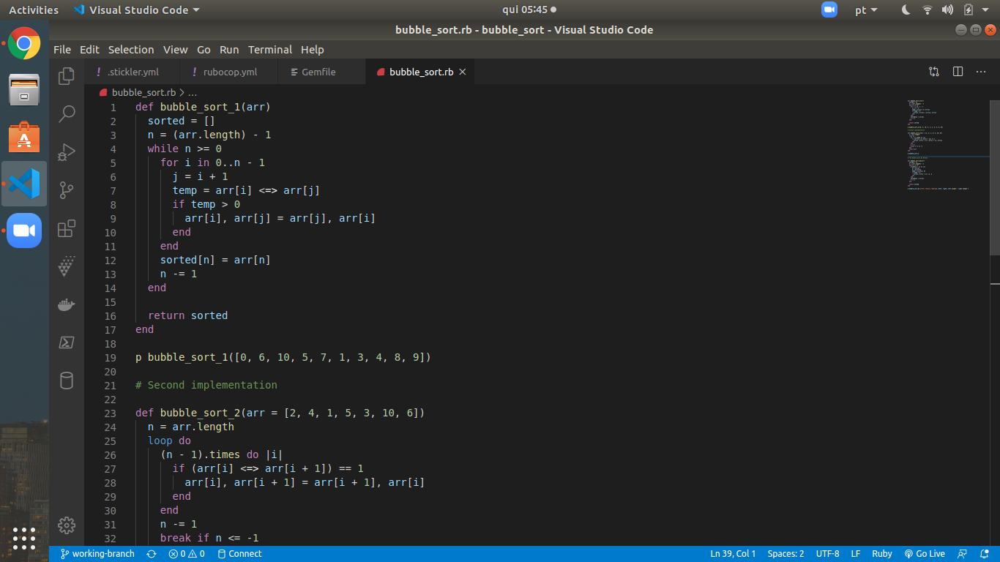
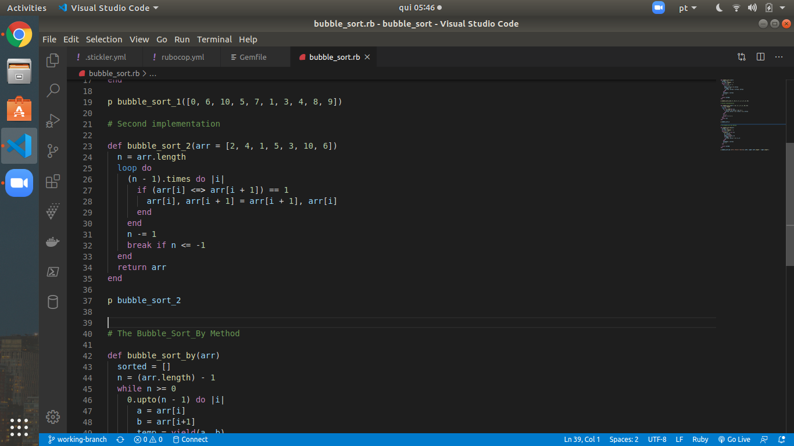
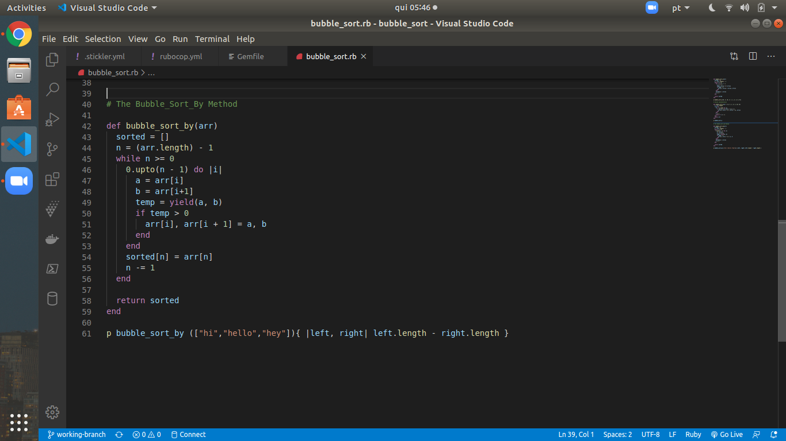
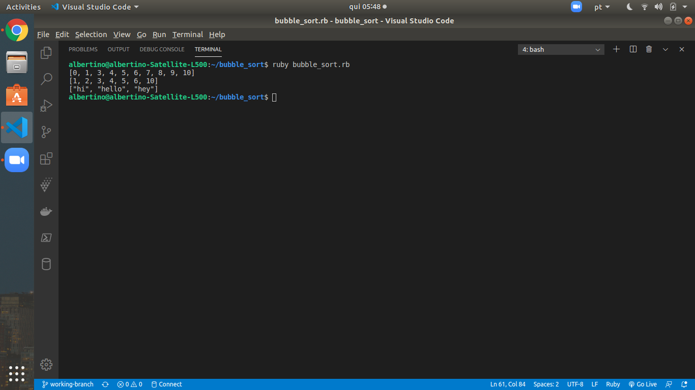

# Advanced Building Blocks - Bubble Sort

> This is our Advanced Building Blocks -Bubble Sort Project from the Microverse Curriculum.  We have implemented the bubble sort algorithm using Ruby. The assignment was focused on the use of yield and passing a block to a method.

## Built With

- Ruby

## Live Demo

[Live Demo Link]()

## Getting Started

## Authors

👤 Albertino Francisco

- Github: [@Albertino2020](https://github.com/Albertino2020)
- Twitter: [@albertino2050](https://twitter.com/albertino2050)
- Linkedin: [Albertino Francisco, PhD](https://linkedin.com/in/boamorte)

👤 Jeilil Faisal

- Github: [@JelilFisalAbudu](https://github.com/JelilFaisalAbudu)
- Twitter: [@jelilabudu](https://twitter.com/jelilabudu)
- Linkedin: [jelilfaisalabudu](https://linkedin.com/in/jelilfaisalabudu)

## 🤝 Contributing

Contributions, issues and feature requests are welcome!

Feel free to check the [issues page](issues/).

## Show your support

Give a ⭐️ if you like this project!

## 📝 License

This project is [MIT](lic.url) licensed.
